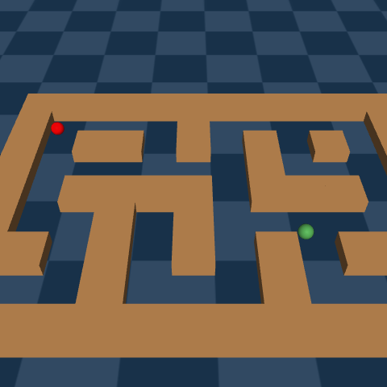
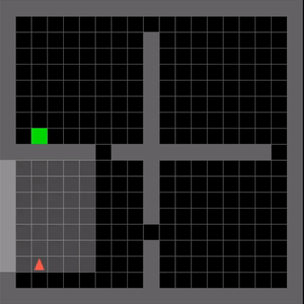
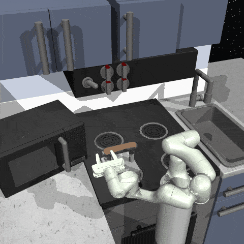

# D4RL to Minari datasets
This repository contains the scripts to convert the [D4RL](https://github.com/Farama-Foundation/D4RL) environment datasets based on MuJoCo to [Minari](https://github.com/Farama-Foundation/Minari) datasets.

The environments used to regenerate the datasets are refactored versions of the originals. These new environment versions are now maintained in the [Gymnasium-Robotics](https://robotics.farama.org/) project, they follow the Gymnasium API, and have been updated to use the latest mujoco bindings from Deepmind.

## Installation

```
git clone https://github.com/Farama-Foundation/minari-dataset-generation-scripts
```

For reproducibility, each set of dataset creation scripts has its own requirements. For example, the Point Maze requirements can be installed with `pip install -r scripts/pointmaze/requirements.txt`.

## Create datasets
### Point Maze
<p align="center">
  
</p>
The point maze datasets have been regenerated using the same `q_iteration` expert policy as in the original D4RL paper. The environments used can be found [here](https://robotics.farama.org/envs/maze/point_maze/).

You can run the script used to regenerate the datasets with:
```
python scripts/pointmaze/create_pointmaze_dataset --env "PointMaze_UMaze-v3" --dataset_name="pointmaze-umaze-v0" --maze-solver="QIteration"
```

This will generate a local Minari dataset named `pointmaze-umaze-v0` for the `PointMaze_UMaze-v3` environment, using `q_iteration` as the expert policy, Depth First Search can also be used as the algorithm to generate a path to the goal by passing "DFS" instead of "QIteration".

### Adroit Hand

<p align="center">
  
   
  
  
</p>


The Minari datasets for the Adroit Hand environments are recreated by reading the original D4RL datasets and adapting them to the Minari standards. The [dataset versions from D4RL](https://github.com/Farama-Foundation/D4RL/wiki/Tasks#adroit) are `v1` and the new Minari datasets name are relabeled to version `v0`. The datasets for the environments include `human`, `expert`, and `cloned`, and they can be created as follows:

`AdroitHandDoor-v1`:
```
python scripts/adroit/recreate_adroit_door.py
```

`AdroitHandHammer-v1`:
```
python scripts/adroit/recreate_adroit_hammer.py
```
`AdroitHandPen-v1`:
```
python scripts/adroit/recreate_adroit_pen.py
```
`AdroitHandRelocate-v1`:
```
python scripts/adroit/recreate_adroit_relocate.py
```

### Ant Maze
<p align="center">
  
</p>

To create the dataset, a goal reaching expert policy was previously trained with the SAC algorithm provided in Stable Baselines 3. This goal reaching policy is then used by the Ant agent to follow a set of waypoints generated by a planner (QIteration) to the final goal location. Six different datasets are available, corresponding to the different configurations of maps and goal/reset positions, as in the original D4RL paper. These can be recreated by changing the working directory to `scripts/antmaze` and then running

```
python create_antmaze_dataset.py
```

### Minigrid
<p align="center">
  
</p>

This dataset generated from the `MiniGrid-FourRooms` environment. The objective of the agent is to reach a goal position in a gridworld. We regenerate the dataset of D4RL for full reproducibility, using a random policy and an expert policy that navigates straight to the goal. The datasets can be recreated as follows:

`minigrid-fourrooms-v0`:

```
python scripts/minigrid/generate_minigrid.py
```

`minigrid-fourrooms-random-v0`:

```
python scripts/minigrid/generate_minigrid.py --random
```

### FrankaKitchen
<p align="center">
  
</p>
The goal of the `FrankaKitchen` environment is to interact with the various objects in order to reach a desired state configuration. These datasets were generated with the `FrankaKitchen-v1` environment, originally hosted in the D4RL and [relay-policy-learning](https://github.com/google-research/relay-policy-learning) repository. These datasets can be recreated using:

```
python scripts/kitchen/create_franka_dataset.py
```


### More datasets to come
* `Gymnasium Mujoco`

## Checking datasets

This repository also provides scripts that run simple checks on the integrity of Minari datasets. For example, generic checks on a dataset can be run using `python checks/check_dataset.py <dataset_id>`.
